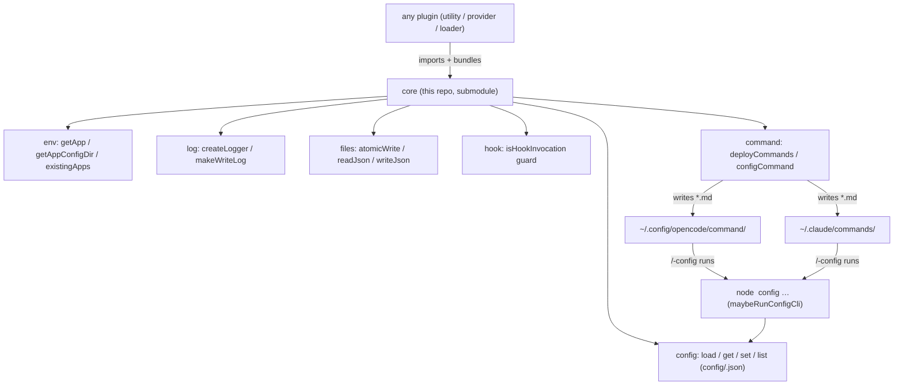

# core

The shared foundation every plugin in the ecosystem builds on. Consumed as a git
submodule and bundled into each plugin (like `core-auth` / `core-loader`), so there
is no runtime install. It supersedes `core-log` (whose config + logging API lives
here now) and adds app detection, the opencode/claude hook guard, file helpers, and
a **cross-app command + config-command framework**.

## Under-the-Hood Architecture



## Structure
- `src/` — `env`, `config`, `log`, `files`, `hook`, `command`, `configcli`, `index` (barrel)
- `dist/` — single bundled `index.js` (generated; not committed). The config CLI ships inside it.

## Installation (for a plugin author)
Add as a submodule and bundle it (esbuild `bundle: true`), importing from `../core/dist/index.js`:
```bash
git submodule add https://github.com/intisy-ai/core core
```
`core` is **not published to npm** — it's a bundled submodule. (Loaders/providers that already carry `core-loader`/`core-auth` can nest `core` inside those, or add it as a second submodule.)

## API
```ts
import {
  getApp, isClaude, getAppConfigDir, existingApps,                  // env
  loadConfig, ensureConfig, getConfigValue, setConfigValue, listConfig, // config
  createLogger, makeWriteLog, globalSetting,                        // log + global settings
  atomicWrite, readJson, writeJson, ensureDir,                      // files
  isHookInvocation,                                                 // hook guard
  deployCommands, configCommand, maybeRunConfigCli,                 // commands
} from "../core/dist/index.js";
```

### Commands (work in both opencode and Claude Code)
Both apps read markdown slash-commands from a directory (`<cfg>/command/` for opencode,
`<cfg>/commands/` for claude). `deployCommands(pluginName, defs)` writes each command to
**both**, so one definition works everywhere. A command may run a shell line whose output
is injected, and `{{BUNDLE}}` resolves to the plugin's deployed file:

```ts
import { deployCommands, configCommand } from "../core/dist/index.js";
deployCommands("wakatime-sync", [
  configCommand("wakatime-sync"),                         // /wakatime-sync-config (100% config)
  { name: "wakatime", description: "Today's tracked time", shell: 'node "{{BUNDLE}}" today' },
]);
```

### 100% configurable via commands
`configCommand(name)` generates a `/<name>-config` command with `list | get <key> | set <key> <value>`.
It shells into the plugin's own bundle, which must call `maybeRunConfigCli` at the top of its entry:

```ts
import { maybeRunConfigCli } from "../core/dist/index.js";
if (maybeRunConfigCli("wakatime-sync")) { /* ran as `node bundle config …`; stop here */ }
else { /* normal plugin activation */ }
```
Every key in `config/<name>.json` is then reachable (`set` coerces `true`/`false`/numbers/JSON).

## Configuration
`core` is the single config system for the ecosystem (don't hand-roll config reading):
- `loadConfig(name)` / `getConfigValue` / `setConfigValue` / `listConfig` / `coerce` read & write the
  consuming plugin's `config/<name>.json` (preferred) or `<name>.json` (fallback).
- **`ensureConfig(name, defaults)`** — call on plugin load to materialize `config/<name>.json` with
  defaults if absent, so every plugin's settings are discoverable on disk. Idempotent; on-disk values win.
- **`globalSetting(key, fallback)`** — reads the GLOBAL `config/settings.json` (the opencode.json-equivalent;
  each app home has its own). Currently holds `logConsole` (mirror logs to the console) + `logColor`.

## Logging
Via `createLogger(name)` / `makeWriteLog(name)` → `<configDir>/logs/YYYY-MM-DD/<name>-HH-MM-SS.log`,
toggle with `"logging": false` in the plugin's config.

## License
MIT
