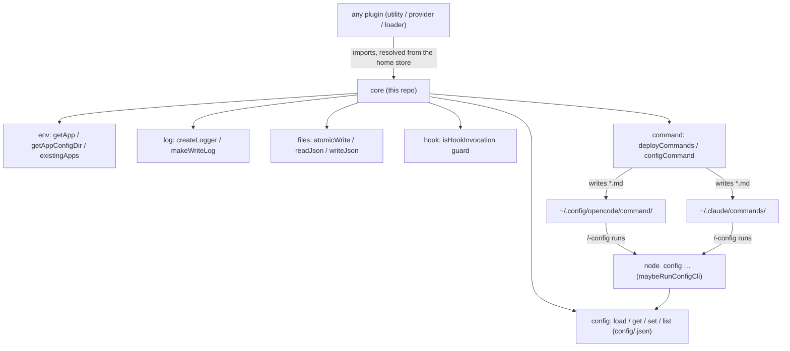

# core

[](https://www.npmjs.com/package/core)
[](https://www.npmjs.com/package/core)

Shared config, logging, and app-detection foundation for the intisy-ai AI-proxy ecosystem.

The shared foundation every plugin in the ecosystem builds on. Published as
`@intisy-ai/core` and resolved from a home's shared library store (like `core-auth` /
`core-loader`), so one copy serves every plugin in that home. It supersedes `core-log` (whose config + logging API lives
here now) and adds app detection, the opencode/claude hook guard, file helpers, and
a **cross-app command + config-command framework**.

## Under-the-Hood Architecture


```mermaid
flowchart TD
    PLUGIN["any plugin (utility / provider / loader)"] -->|imports, resolved from the home store| CORE["core (this repo)"]
    CORE --> ENV["env: getApp / getAppConfigDir / existingApps"]
    CORE --> CFG["config: load / get / set / list (config/<name>.json)"]
    CORE --> LOG["log: createLogger / makeWriteLog"]
    CORE --> FILES["files: atomicWrite / readJson / writeJson"]
    CORE --> HOOK["hook: isHookInvocation guard"]
    CORE --> CMD["command: deployCommands / configCommand"]
    CMD -->|writes *.md| OCDIR["~/.config/opencode/command/"]
    CMD -->|writes *.md| CCDIR["~/.claude/commands/"]
    OCDIR -->|/<plugin>-config runs| CLI["node <bundle> config …  (maybeRunConfigCli)"]
    CCDIR -->|/<plugin>-config runs| CLI
    CLI --> CFG
```

## Structure
- `src/` — `env`, `config`, `log`, `files`, `hook`, `command`, `configcli`, `index` (barrel)
- `dist/` — single bundled `index.js` (generated; not committed). The config CLI ships inside it.

## Installation (for a plugin author)
```bash
npm install @intisy-ai/core
```
Leave it `external` in your bundle (esbuild `--external:@intisy-ai/core`). A home installs the union
of what its deployed plugins declare, so one copy is materialised per home rather than inlined into
each plugin.

## API
```ts
import {
  getApp, getAppConfigDir, existingApps,                             // env
  loadConfig, defineConfig, getConfigDefaults, getConfigValue, setConfigValue, listConfig, // config
  createLogger, makeWriteLog, globalSetting,                        // log + global settings
  atomicWrite, readJson, writeJson, ensureDir,                      // files
  isHookInvocation,                                                 // hook guard
  deployCommands, configCommand, maybeRunConfigCli,                 // commands
} from "../core/dist/index.js";
```

### Commands (work in both opencode and Claude Code)
Both apps read markdown slash-commands from a directory (`<cfg>/command/` for opencode,
`<cfg>/commands/` for claude). `deployCommands(pluginName, defs)` writes each command to
**both**, so one definition works everywhere. A command may run a shell line whose output
is injected, and `{{BUNDLE}}` resolves to the plugin's deployed file:

```ts
import { deployCommands, configCommand } from "../core/dist/index.js";
deployCommands("wakatime-sync", [
  configCommand("wakatime-sync"),                         // /wakatime-sync-config (100% config)
  { name: "wakatime", description: "Today's tracked time", shell: 'node "{{BUNDLE}}" today' },
]);
```

### 100% configurable via commands
`configCommand(name)` generates a `/<name>-config` command with `list | get <key> | set <key> <value>`.
It shells into the plugin's own bundle, which must call `maybeRunConfigCli` at the top of its entry:

```ts
import { maybeRunConfigCli } from "../core/dist/index.js";
if (maybeRunConfigCli("wakatime-sync")) { /* ran as `node bundle config …`; stop here */ }
else { /* normal plugin activation */ }
```
Every key in `config/<name>.json` is then reachable (`set` coerces `true`/`false`/numbers/JSON).

## Configuration
`core` is the single config system for the ecosystem (don't hand-roll config reading):
- `loadConfig(name)` / `getConfigValue` / `setConfigValue` / `listConfig` / `coerce` read & write the
  consuming plugin's `config/<name>.json` (preferred) or `<name>.json` (fallback).
- **`defineConfig(name, defaults)`** — call on plugin load (BEFORE the `maybeRunConfigCli` guard) to
  **register** a plugin's settings + defaults. Writes **nothing** — launching never creates a config file.
  Returns the effective config (defaults + on-disk); `getConfigDefaults(name)` reads the registered defaults.
- Settings are editable through the **loader** (Plugins → Configure), which discovers core-plugins via
  `node <bundle> config schema` and saves with `config set` — the only thing that writes a file.
- **`globalSetting(key, fallback)`** — reads the GLOBAL `config/settings.json` (the opencode.json-equivalent;
  each app home has its own). Currently holds `logConsole` (mirror logs to the console), `logColor`,
  and the activity retention knobs `activityMaxBytes` / `activityMaxDays` (0 = unlimited, the default;
  history is kept forever unless a limit is set) plus `activityMinImpact`.

## Logging
Via `createLogger(name)` / `makeWriteLog(name)` → `<configDir>/logs/YYYY-MM-DD/<name>-HH-MM-SS.log`,
toggle with `"logging": false` in the plugin's config.

## License

[](LICENSE)
